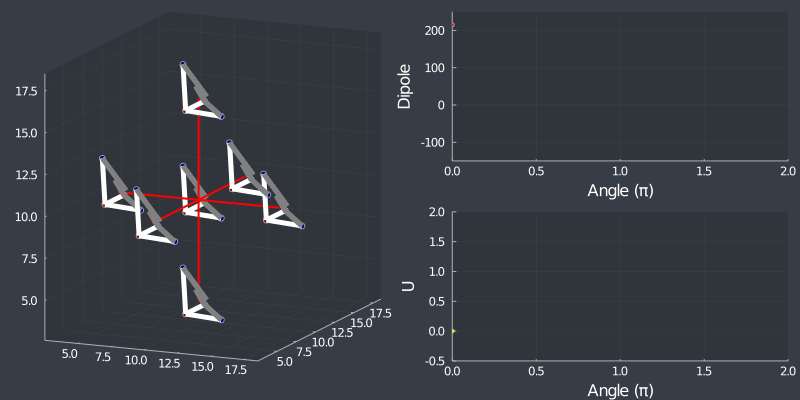

# Pseudo Spin phase transition in metal halide perovskites

Very early commit on an ongoing project.
Blog posts about the progress can be read at

Part 1 - http://www.santoshkumarradha.me/blog/2020/julia-MC2/

Part 2 - http://www.santoshkumarradha.me/blog/2020/julia-MC/

### Things to do

1. MC steps
2. Memory and speed test with system size
3. Fit coupling parameter to real DFT energies

### Check list completed

1. ~Periodic boundary conditions~ 

2. ~rotation of tetrahedrons~ 

3. ~Nearest Neighbor Dipole and Bonding term caculation~

